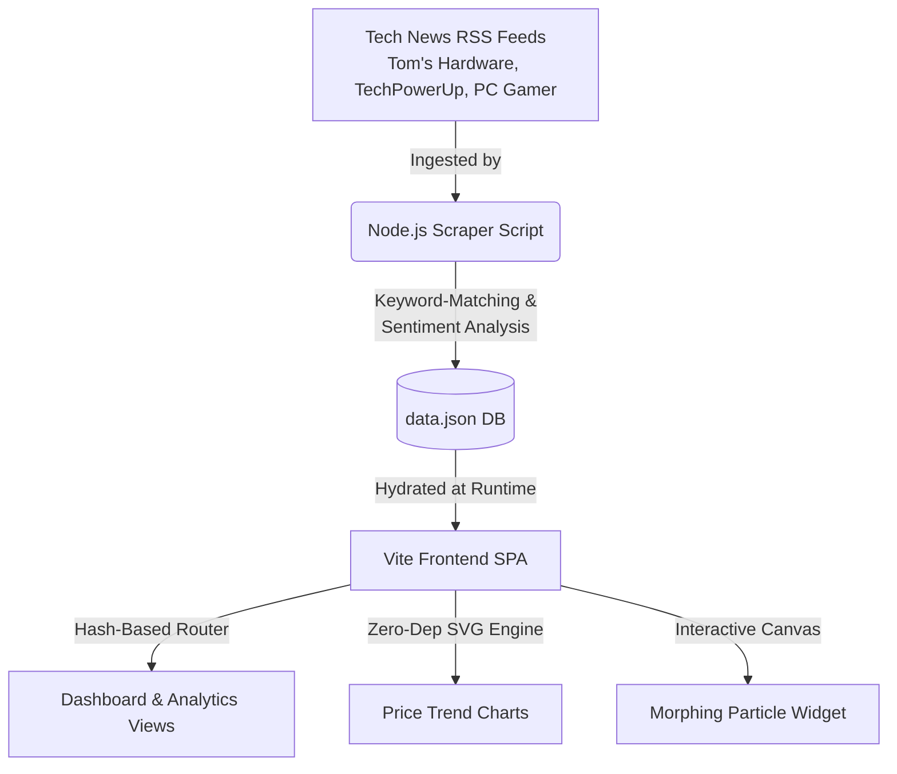

# PriceOracle — Hardware Price Prediction Core & Market Analytics

<div align="center">
  
</div>

<p align="center">
  <strong>Algorithmic Price Forecasting Engine & Real-time Market Intelligence for PC Hardware & Laptops.</strong>
</p>

<p align="center">
  <a href="https://priceoracle.pages.dev"></a>
  <a href="https://github.com/Lumina-Frameworks/PriceOracle/actions"></a>
  <a href="LICENSE"></a>
</p>

---

## 🔮 What is PriceOracle?

**PriceOracle** is a modern, high-fidelity web application and background scraper designed to track, analyze, and forecast price movements for PC hardware (RAM, GPUs, CPUs) and Laptops. 

By analyzing real-time tech news sentiment from major publications and combining it with historical price structures, PriceOracle calculates short-term price predictions and index trends, presenting them through a stunning, glassmorphic UI complete with dynamic interactive visual widgets.

### 🌟 Key Features

*   📈 **Category Price Indexes:** 30-day aggregate price index tracking for RAM, GPUs, CPUs, and Laptops, capturing baseline valuation movements.
*   🧠 **Neural Forecasting Simulation:** Projected 7-day price changes with dynamic algorithmic confidence percentages calculated from market indicators.
*   📊 **Zero-Dependency SVG Charts:** High-performance, lightweight vector line charts rendered entirely on the client side using pure JavaScript & inline SVGs.
*   📰 **Sentiment-Driven News Engine:** Automated RSS ingestion from authorized tech outlets with integrated sentiment indexing (Bullish / Bearish / Neutral).
*   ✨ **Premium UI Experience:** Immersive dark-mode first design with glassmorphic cards, glowing neon accent outlines, and interactive morphing HTML5 Canvas background particle models.
*   🌗 **Seamless Light/Dark Themes:** Fluid theme-toggle engine with saved user preference state persistence.

---

## ⚙️ How it Works (Architecture)



### 1. The Data Pipeline & News Scraper (`scraper.js`)
The Node.js scraper uses `rss-parser` to regularly pull the latest feeds from authoritative hardware portals. It parses the headlines and content, performing two primary tasks:
*   **Item Mapping:** Matches news items to specific hardware parts (e.g. RTX 4070, Ryzen 7800X3D) based on a comprehensive keyword dictionary.
*   **Sentiment Profiling:** Computes article sentiment using weighted bullish phrases (such as *shortage*, *inflation*, *growth*) versus bearish phrases (*oversupply*, *surplus*, *discount*).

### 2. Client-Side Presentation (`app.js`)
On page load, the frontend fetches the compiled `data.json` database. If the fetch succeeds, it hydrates the view dynamically; if it fails, it gracefully falls back to an embedded sample dataset to maintain user interaction.

---

## 📁 Repository Structure

```bash
├── index.html          # Main SPA template & entry structure
├── styles.css          # Design system, glassmorphism, & responsive layout
├── app.js              # Hash router, SVG charting engine, and Canvas animation
├── scraper.js          # Node.js RSS scraper & sentiment analyser
├── data.json           # Active database (holds price history, news, and outlooks)
├── banner.png          # High-fidelity project graphic asset
└── package.json        # Project scripts & dependencies
```

---

## 🚀 Setup & Run Locally

Getting a local developer instance running is incredibly straightforward.

### Prerequisites
Make sure you have [Node.js](https://nodejs.org/) installed on your machine.

### Installation

1. Clone the repository and navigate to its folder:
   ```bash
   git clone https://github.com/Lumina-Frameworks/PriceOracle.git
   cd PriceOracle
   ```

2. Install dependencies:
   ```bash
   npm install
   ```

### Execution

*   **Start the Development Server:**
   ```bash
   npm run dev
   ```
   Vite will spin up a hot-reloading development server, typically at `http://localhost:5173`.

*   **Build for Production:**
   ```bash
   npm run build
   ```
   Generates static build artifacts in the `dist` directory, ready to deploy to platforms like Cloudflare Pages, GitHub Pages, or Vercel.

*   **Trigger the Scraper:**
   ```bash
   npm run scrape
   ```
   Runs `scraper.js` locally to scan the RSS feeds and update `data.json` with fresh news items and updated sentiment indexes.

---

## 🎨 Interactive Particle canvas
On the main hero dashboard, PriceOracle displays an **interactive, morphing vector widget** built using standard HTML5 Canvas.

*   **Morphing Geometries:** Particles automatically shift layouts to form a **CPU core layout**, a **GPU die configuration**, a **RAM DIMM model**, or a **Laptop casing**.
*   **Visual Interactions:** Moving your mouse over the canvas repels particles, and clicking anywhere triggers a physics-based shockwave that scatters particles before they gracefully return to their target nodes.

---

## 📝 License
This project is licensed under the **ISC License**. See the [package.json](file:///c:/Users/Aliff%20Ros/Documents/Anti-Gravity%20Projects/PriceOracle/package.json) file for details.

---

<p align="center">
  Created with ❤️ by the <strong>Lumina Frameworks</strong> team.
</p>
